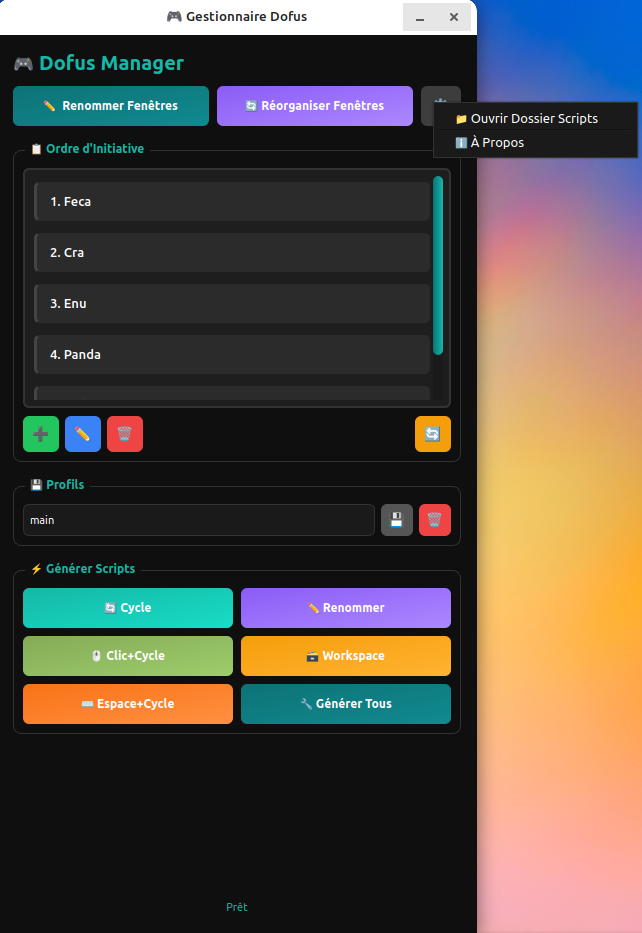

# Dofus Window Manager

---

### 🎮 Gestionnaire de Fenêtres Dofus sous Linux pour le multicompte

* Ne modifie pas le client et n'automatise aucune action en jeu, ce qui reste conforme aux CGU.

#### 🖥️ Environnements testés

* **OS** : Linux Mint 21 et 22
* **Desktop** : Cinnamon

#### 🖼️ Aperçu de l'interface



#### 🚀 Fonctionnalités

* ⚡ **Renommage instantané des fenêtres**
* 🔁 **Génération de scripts bash** pour le switch de fenêtres Dofus (avant/arrière)
* 🖥️ **Switch entre les espaces de travail** avec une seule touche
* 📁 **Gestion des profils d'initiatives** — sauvegarde et chargement de configurations
* 🧠 **Générateur de scripts automatique** — crée les scripts shell pour chaque action
* ⌨️ **Scripts composés** — combinaisons touches + cycles (espace, clic, etc.)
* 🪶 **Interface PyQt6 minimaliste et rapide**
* 🌍 **Support multilingue** — français et anglais
* 🎯 **Optimisé pour le multicompte** — raccourcis clavier complets

#### 📋 Structure du projet

```
dofus_window_manager/
├── main.py                    # Point d'entrée de l'application
├── core/
│   ├── config.py              # Configuration centralisée et chemins des fichiers
│   ├── scripts.py             # Génération automatique des scripts shell
│   ├── workspace.py           # Gestion des espaces de travail (wmctrl)
│   ├── utils.py               # Utilitaires (exécution, permissions)
│   ├── i18n.py                # Système de localisation (FR/EN)
│   └── __init__.py
├── ui/
│   ├── main_window.py         # Fenêtre principale (PyQt6)
│   ├── widgets.py             # Widgets personnalisés (liste draggable)
│   ├── theme.py               # Thème sombre moderne
│   └── __init__.py
├── extensions/
│   ├── overlay.py             # Placeholder pour overlay futur
│   └── __init__.py
├── .gitignore
└── README.md
```

#### ⚙️ Prérequis

* **Python 3.10+**
* **PyQt6**
* **wmctrl** et **xdotool** (utilitaires Linux pour contrôler les fenêtres)

Installation des dépendances :

```bash
python3 -m venv venv
source venv/bin/activate
pip install PyQt6
sudo apt install wmctrl xdotool
```

#### 💡 Utilisation

##### 1. Lancer l'application

```bash
python3 main.py
```

##### 2. Configurer vos fenêtres Dofus

* Ajouter ou modifier les noms de classes
* Définir l'ordre d'initiative
* Sauvegarder la configuration en tant que profil

##### 3. Générer les scripts

Cliquez sur les boutons correspondants ou **"Générer Tous les Scripts"** pour créer :

* `cycle_forward.sh` — Cycle avant
* `cycle_backward.sh` — Cycle arrière
* `rename_windows.sh` — Renommer les fenêtres
* `reorganize_windows.sh` — Réorganiser les fenêtres
* `click_cycle_forward.sh` — Clic + cycle avant
* `space_cycle_forward.sh` — Appui espace + cycle avant
* `toggle_workspace.sh` — Bascule d'espace de travail

#### 4. Compiler l'application

Pour créer un exécutable standalone :
```bash
chmod +x build_app.sh
./build_app.sh
```

Cela va générer un fichier exécutable `dofus_manager` à la racine du projet. Vous pouvez ensuite le lancer directement :
```bash
./dofus_manager
```

**Note** : La compilation nécessite PyInstaller. Le script l'installera automatiquement s'il n'est pas présent.

#### 📝 Notes

* L'interface sert principalement à la configuration des scripts
* L'utilisation quotidienne repose sur les **raccourcis clavier** liés aux scripts générés
* Les scripts sont indépendants et peuvent être exécutés directement
* Les scripts combinés (clic, espace) sont utiles pour des actions complexes en jeu

#### 🎮 Raccourcis suggérés

Configurez dans vos paramètres clavier :

```
Super + Right          → cycle_forward.sh
Super + Left           → cycle_backward.sh
Super + Space          → space_cycle_forward.sh (espace + cycle avant)
Super + Up             → rename_windows.sh (renommer fenêtres)
Super + Down           → reorganize_windows.sh (réorganiser)
Super + Shift + Space  → toggle_workspace.sh (changer espace travail)
```

#### 📦 Dossier des scripts

Les scripts générés se trouvent dans :
```
~/.config/dofus_window_manager/scripts/
```

Tous les scripts sont exécutables directement :
```bash
~/.config/dofus_window_manager/scripts/cycle_forward.sh
```

---

**© 2025 Dofus Manager** — Gestionnaire de fenêtres Linux conforme aux CGU Dofus